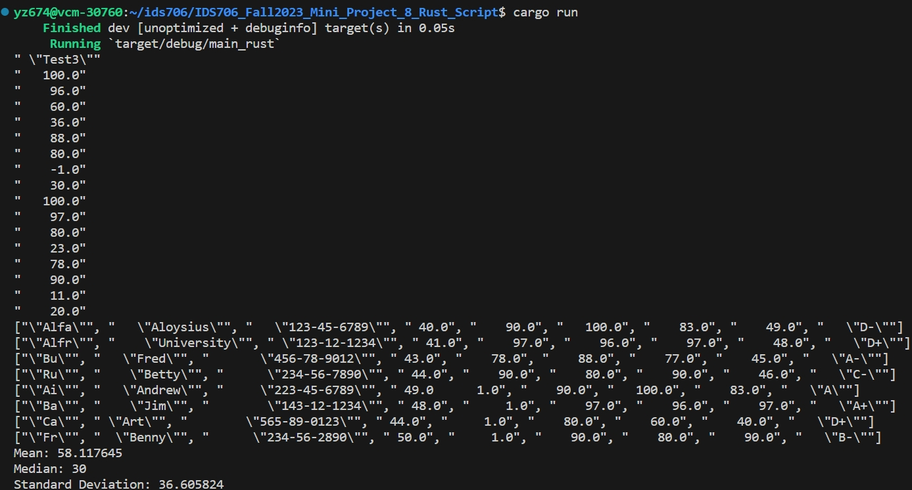
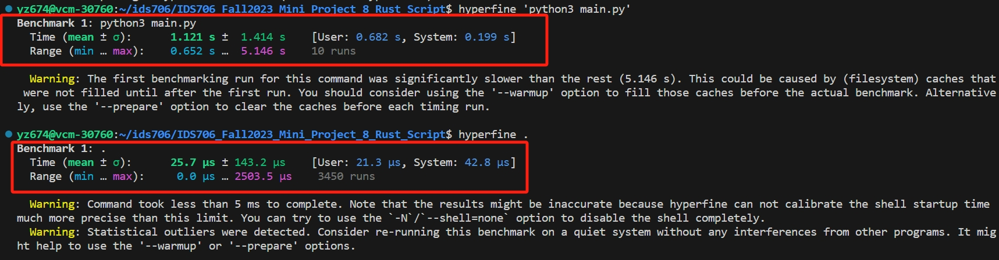

[](https://github.com/yuchenz427/IDS706-Python-Template/actions/workflows/install.yml)
[](https://github.com/yuchenz427/IDS706-Python-Template/actions/workflows/lint.yml)
[](https://github.com/yuchenz427/IDS706-Python-Template/actions/workflows/format.yml)
[](https://github.com/yuchenz427/IDS706-Python-Template/actions/workflows/test.yml)
# IDS706_Fall2023_Mini_Project_8_Rust_Script

IDS706 week 8 mini project: Rewrite a Python script for data processing in Rust, highlighting the improvements in speed and resource usage.

It contains:

- ``main.py`` the original Python script that performs a simple data processing task from a csv file.

- ``src`` includes the Rust project translated from the Python script.


## How to test

First run 
```bash
make all
```
to run the whole install lint format test pipeline for the rust project. Then run
```bash
cargo run
```
to run the Rust program. It should show the result below:<br>

<br>
Which performs the same data processing task as the Python script in my mini project 2.

## Performance comparison
Use `hyperfine` to measure the performance of the Python script and Rust program, performing the same data processing task.<br>

<br>
The result shows that the Rust program has a mean execution time around 100 us, much faster than Python's execution time, which is around 2s.